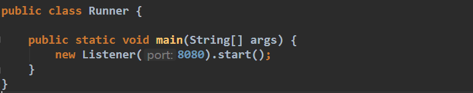
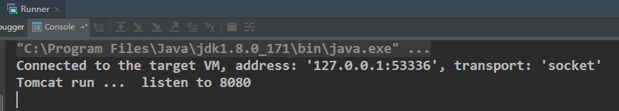
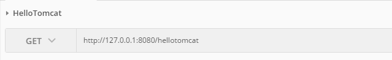
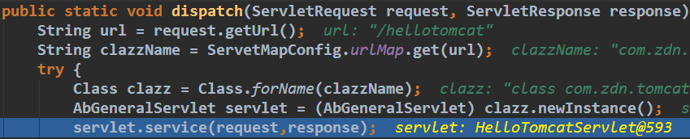
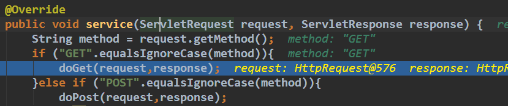
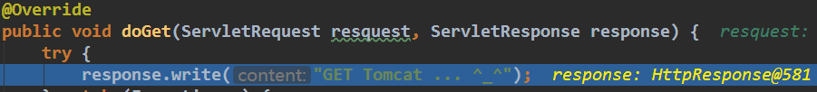
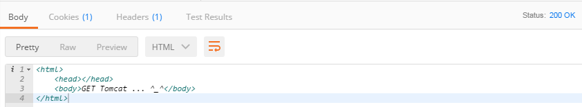

# zdn-tomcat
---
>学习来源:java技术栈微信公众号

通过学习后.简单实现一个**Tomcat**

- 模块
   1. 容器 Container
   2. 连接 Connector
   3. 监听 Listener
   
- 传送门
   1. [Container](https://github.com/Zdn1992/zdn-tomcat/tree/master/src/main/java/com/zdn/tomcat/engine)
   2. [Connector](https://github.com/Zdn1992/zdn-tomcat/tree/master/src/main/java/com/zdn/tomcat/connector)
   3. [Listener](https://github.com/Zdn1992/zdn-tomcat/tree/master/src/main/java/com/zdn/tomcat/listen)
   
---
### 测试
1. 启动项目 监听8080

2. 客户端发起GET请求

3. 通过Connector连接分派请求到相应的servlet,并通过反射进行初始化

4. 根据请求方式找到具体的处理方法

5. 处理并返回

6. 客户端收到响应

